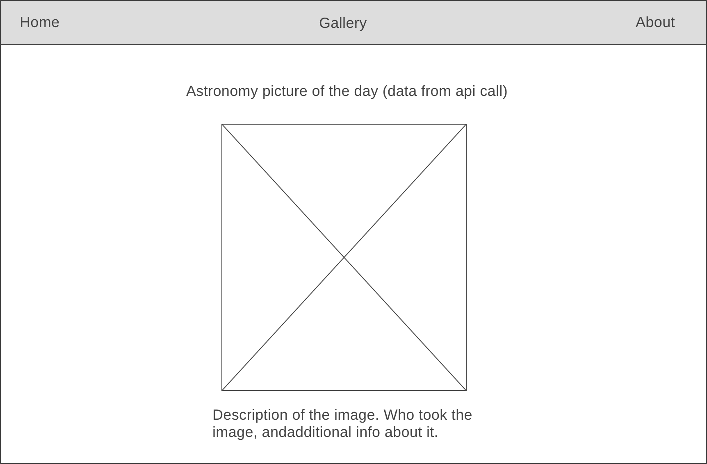
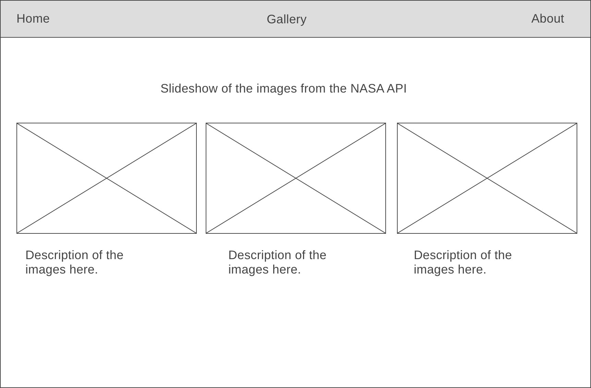
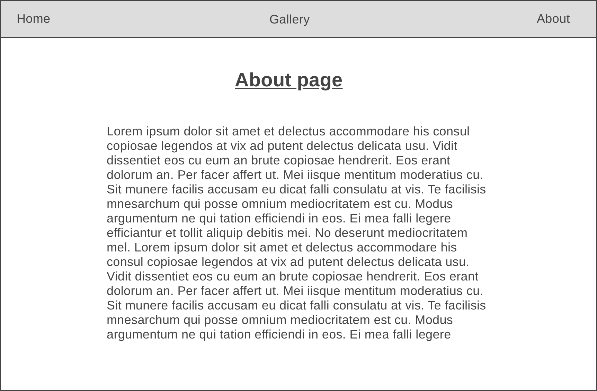

Third party API: https://api.nasa.gov/

App is for educational purposes for those interested in Astronomy.

Target audience: For students or the general public interested in some Astronomy or space enthusiasts.

Home page will display photo or video of the day and will be updated daily. Users will be able to search the NASA Image Gallery.

Wireframe: 

Wireframe: 

Wireframe: 

This project was bootstrapped with [Create React App](https://github.com/facebook/create-react-app).

